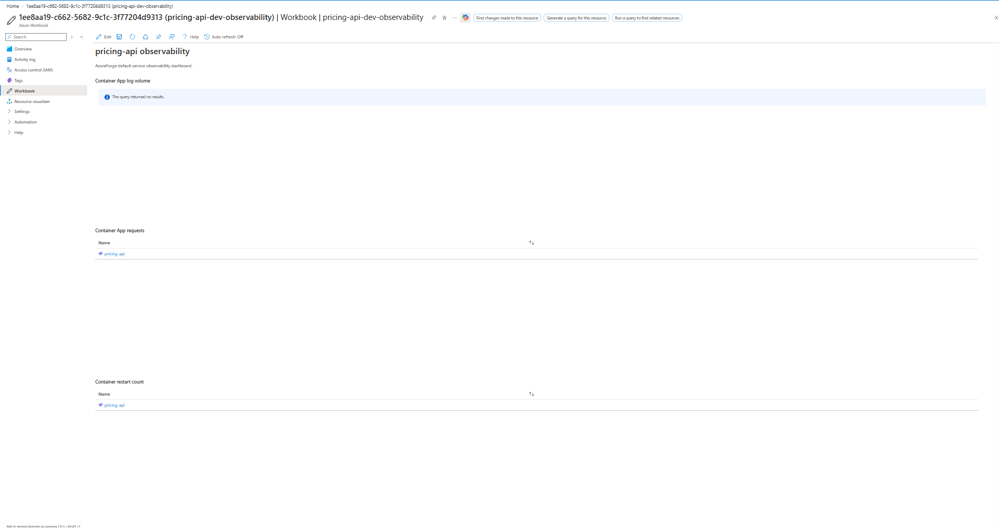

# AzureForge

AzureForge is an opinionated internal developer platform for provisioning production-oriented Azure services through declarative service specifications.

The platform provides a governed golden path for application teams while keeping privileged infrastructure changes reviewable through GitHub pull requests and applying Terraform with federated Azure identity.

## Status

**P12 complete — AzureForge now provides an optional governed Kubernetes namespace capability for reuse of an externally managed/shared AKS cluster, without taking ownership of the cluster lifecycle.**

AzureForge can translate developer namespace intent into deterministic Terraform desired state and compose a Kubernetes `Namespace`, `ResourceQuota`, and `LimitRange`. The capability is validated with mocked Terraform tests because no live shared AKS cluster was available during P12.

Next implementation phase: **P13 — documentation polish and onboarding demo**.

## Current Capabilities

AzureForge currently provides:

- a declarative YAML service specification;
- a .NET 10 C# CLI;
- YAML parsing into a typed service model;
- golden-path and catalog validation;
- field-level validation errors;
- deterministic CLI exit codes;
- automated parser and validator tests;
- reusable Terraform foundation modules;
- native Terraform module tests;
- a tested Terraform composition example.
- deterministic service-spec to Terraform desired-state generation;
- canonical `.tfvars.json` serialization;
- golden-file testing for generated Terraform input.
- GitHub Actions provisioning-request generation;
- deterministic provisioning branches and `.tfvars.json` artifacts;
- pull-request-based human review before privileged infrastructure execution.
- reusable Terraform modules and environment composition;
- Azure Blob Storage remote Terraform state;
- secretless GitHub-to-Azure authentication using OIDC;
- live Azure Container Apps provisioning;
- user-assigned workload identity;
- Log Analytics and Application Insights baseline;
- configurable Container Apps scaling and ingress;
- optional Azure Database for PostgreSQL Flexible Server provisioning;
- optional Azure Service Bus namespace and queue provisioning;
- deterministic globally unique PaaS resource naming;
- PostgreSQL administrator credentials supplied through GitHub Actions secrets rather than reviewed desired-state artifacts;
- Service Bus local/SAS authentication disabled in favor of identity-based access;
- composition tests covering PostgreSQL-only, Service-Bus-only, combined, and neither-capability configurations.
- default Azure Monitor workbook provisioning for each service;
- Container App log-volume, request, and restart visualizations;
- standard HTTP 5xx and container-restart metric alerts;
- desired-state-controlled alert policy using `standard` or `none`;
- observability composition tests covering standard alerts and workbook-only configurations.
- reusable Terraform governance module for Azure Policy;
- deny-mode enforcement of approved Azure regions;
- approved deployment regions restricted to `westeurope` and `northeurope`;
- mandatory `service`, `team`, `environment`, `managed-by`, and `criticality` resource tags;
- enforced `managed-by=azureforge` ownership marker;
- resource-group-scoped Azure Policy assignments;
- custom Azure Policy definitions managed through reviewed Terraform workflows;
- GitHub OIDC policy deployment without long-lived Azure credentials;
- Terraform governance tests for valid and unsafe configurations;
- live Azure Policy negative tests proving unsafe resource creation is denied.
- Scheduled Terraform drift detection against reviewed service desired state.
- GitHub OIDC authentication with no long-lived Azure credentials.
- Terraform `-detailed-exitcode` classification for clean state, drift, and execution errors.
- GitHub Actions job summaries and retained Terraform drift-report artifacts.
- Visible workflow failure when drift is detected, without automatic remediation.
- per-environment Azure cost budgets through Terraform;
- declarative monthly budget configuration using `cost.monthlyBudgetEur`;
- declarative environment lifecycle configuration using `lifecycle.ttlDays`;
- environment TTL validation restricted to 1–90 days;
- reusable Terraform cost-control module;
- Terraform composition tests covering valid cost controls and invalid budget/TTL configuration.
- optional governed Kubernetes namespace capability;
- reuse of an externally managed/shared AKS cluster rather than provisioning another cluster;
- deterministic AKS namespace naming derived from `service.name`;
- namespace-level `ResourceQuota` and `LimitRange` governance;
- AzureForge service, team, environment, and ownership labels on managed namespaces;
- Kubernetes authentication supplied by the trusted execution environment through kubeconfig rather than generated service desired state;
- mocked Terraform module and composition tests for the AKS namespace capability.

P5 carries deterministic desired state into a reviewable GitHub pull request. After human review and merge, privileged GitHub OIDC Terraform workflows consume that approved artifact to provision the P6 compute baseline, optional P7 PaaS capabilities, the P8 observability baseline, the P9 Azure Policy governance baseline, and the P11 cost-control baseline. P10 continuously checks the deployed environment for Terraform drift without automatically remediating it. P11 extends the developer-facing contract with monthly cost budgets and bounded environment lifecycle configuration. P12 extends the same contract with an optional Kubernetes namespace capability while preserving the infrastructure ownership boundary: AzureForge manages namespace-level developer platform resources, while the shared AKS cluster remains externally managed.

## CLI

The P1 CLI validates an AzureForge service specification before it reaches later infrastructure-generation stages.

Validate the example service:

```powershell
dotnet run --project ".\src\AzureForge.Cli" -- validate ".\examples\pricing-api.yaml"
```

Expected output:

```text
Valid AzureForge service specification: pricing-api
```

A successful validation returns exit code `0`.

Invalid specifications return field-level validation errors and exit code `4`.

For example:

```powershell
dotnet run --project ".\src\AzureForge.Cli" -- validate ".\tests\AzureForge.Cli.Tests\Fixtures\invalid-policy.yaml"
```

Malformed YAML is also rejected before domain validation.

## Testing

Build the solution:

```powershell
dotnet build
```

Run the automated .NET test suite:

```powershell
dotnet test
```

P1 includes tests covering:

- valid golden-path specifications;
- malformed YAML;
- unsupported runtimes;
- mandatory workload identity;
- invalid replica configuration;
- duplicate Service Bus queues.

Run the P2 Terraform validation suite:

```powershell
.\scripts\test-terraform.ps1
```

## P0 — Platform Definition

The P0 design artifacts establish AzureForge's customers, golden path, guardrails, architecture, and provisioning security boundary.

- [`docs/product-brief.md`](docs/product-brief.md) — internal customers, value proposition, platform boundary, and success criteria.
- [`docs/golden-path.md`](docs/golden-path.md) — initial supported developer experience and service pattern.
- [`docs/guardrails.md`](docs/guardrails.md) — mandatory controls, defaults, and restricted choices.
- [`docs/architecture/overview.md`](docs/architecture/overview.md) — control-plane and provisioning architecture.
- [`docs/decisions/0001-pr-driven-provisioning.md`](docs/decisions/0001-pr-driven-provisioning.md) — security decision for PR-driven provisioning.
- [`examples/pricing-api.yaml`](examples/pricing-api.yaml) — representative AzureForge service specification.

## P1 — Service-Spec Validation CLI

P1 turns the service specification defined in P0 into an executable platform contract.

The implementation includes:

- `System.CommandLine`-based C# CLI;
- YamlDotNet parsing;
- strongly typed service-spec models;
- golden-path domain validation;
- explicit process exit codes;
- xUnit parser and validator tests;
- valid and invalid YAML test fixtures.

See [`docs/p1-cli-validation.md`](docs/p1-cli-validation.md) for the P1 design and validation rules.

## P2 — Terraform Module Library

P2 introduces reusable Terraform modules for the AzureForge infrastructure foundation:

- resource group with approved-region and mandatory-tag validation;
- user-assigned managed identity for secretless workload authentication;
- Log Analytics and workspace-based Application Insights;
- native Terraform tests using mocked AzureRM providers;
- a foundation example proving module-to-module composition without creating live Azure resources.

See [`docs/p2-terraform-modules.md`](docs/p2-terraform-modules.md) and [`infra/modules/README.md`](infra/modules/README.md).

Run the P2 validation suite:

```powershell
.\scripts\test-terraform.ps1
```

The current P2 test suite verifies:

- resource-group validation and metadata rules;
- managed identity configuration;
- monitoring baseline configuration;
- invalid retention handling;
- module-to-module composition.

P2 validation runs without Azure credentials and does not create live Azure resources.

## P3 — Remote State and GitHub OIDC

P3 establishes the remote Terraform state and secretless CI authentication foundation:

- Azure Blob Storage for Terraform remote state;
- blob versioning and delete-retention protection;
- a user-assigned managed identity for GitHub Actions;
- a federated identity credential scoped to the AzureForge repository and trusted branch;
- container-scoped `Storage Blob Data Contributor` access for Terraform state;
- a GitHub Actions OIDC smoke workflow proving Azure login and backend initialization without long-lived credentials.

See [`docs/p3-remote-state-oidc.md`](docs/p3-remote-state-oidc.md).

The GitHub workflow uses short-lived OIDC tokens and does not require an Azure client secret, storage account key, or SAS token.

## P4 - Terraform Variable Generation

P4 turns a validated AzureForge service specification into deterministic Terraform input variables.

The implementation includes:

- a typed Terraform desired-state model;
- deterministic mapping from validated service specifications;
- platform-owned defaults for the initial `dev` environment and `westeurope` region;
- AzureForge resource naming and mandatory tag generation;
- stable ordering for Service Bus queues and tags;
- canonical snake_case JSON serialization;
- a `generate` CLI command that writes `.tfvars.json`;
- golden-file tests proving generated desired state remains stable.

Example:

```powershell
dotnet run --project .\src\AzureForge.Cli -- generate `
  .\examples\pricing-api.yaml `
  --output .\generated\pricing-api.tfvars.json
```

See [`docs/p4-terraform-variable-generation.md`](docs/p4-terraform-variable-generation.md).

P4 performs no Azure API calls and creates no infrastructure. The generated file is the deterministic desired-state input consumed by later provisioning phases.

## P5 - Provisioning Pull Request

P5 turns deterministic AzureForge desired state into a reviewable provisioning pull request.

The GitHub Actions workflow:

- accepts an AzureForge service specification through `workflow_dispatch`;
- builds and tests the AzureForge CLI;
- invokes the P4 desired-state generator;
- writes the result under `provisioning/services/<service>/<environment>.tfvars.json`;
- uses a deterministic provisioning branch per service and environment;
- creates or updates a GitHub pull request for human review.

For the representative `pricing-api` service:

```text
Source:
examples/pricing-api.yaml

Artifact:
provisioning/services/pricing-api/dev.tfvars.json

Branch:
azureforge/provision/pricing-api-dev

Pull request:
provision: pricing-api dev
```

The P5 workflow has repository permissions for branch and pull-request creation only:

```yaml
permissions:
  contents: write
  pull-requests: write
```

It does not request GitHub OIDC tokens, authenticate to Azure, execute Terraform, approve its own pull requests, or merge them.

See [`docs/p5-provisioning-pr.md`](docs/p5-provisioning-pr.md).

The pull request therefore forms the human review boundary between developer intent and later privileged Azure provisioning.

## P6 — Container Apps Golden Path

P6 converts the human-reviewed desired state produced by P5 into live Azure infrastructure.

The privileged provisioning workflow is:

```text
.github/workflows/p6-provision-container-app.yml
```

The deployment boundary is:

```text
service specification
        ↓
deterministic desired state
        ↓
provisioning pull request
        ↓
HUMAN REVIEW + MERGE
        ↓
GitHub Actions
        ↓
GitHub OIDC
        ↓
Terraform remote state
        ↓
Azure Container Apps
```

The initial `pricing-api` deployment provisions:

- Azure Resource Group;
- user-assigned managed identity;
- Log Analytics workspace;
- workspace-based Application Insights;
- Azure Container Apps environment;
- Azure Container App.

The reusable Container Apps module is located at:

```text
infra/modules/container-app
```

The initial environment composition root is:

```text
infra/environments/dev
```

The privileged workflow uses the federated GitHub identity established in P3. No Azure client secret is stored in GitHub.

Terraform state is stored in Azure Blob Storage using Microsoft Entra ID authentication.

The P5 workflow retains repository and pull-request permissions only and does not authenticate to Azure. Privileged Terraform execution occurs only after the generated provisioning artifact has crossed the human review and merge boundary.

For the portfolio environment, the Terraform GitHub identity has `Contributor` at subscription scope for workload provisioning and `Storage Blob Data Contributor` on the Terraform state container. A production implementation should reduce this deployment scope through a dedicated landing-zone scope and/or custom provisioning role.

The initial `pricing-api` deployment was successfully provisioned in `westeurope` with:

```text
Resource Group:
rg-pricing-api-dev-weu

Managed Identity:
id-pricing-api-dev

Log Analytics:
log-pricing-api-dev-weu

Application Insights:
appi-pricing-api-dev

Container Apps Environment:
cae-pricing-api-dev-weu

Container App:
pricing-api
```

The Container App was verified in Azure with:

```text
provisioningState: Succeeded
```

The initial service uses internal ingress:

```text
public_ingress = false
```

PostgreSQL and Service Bus are added as optional composable capabilities in P7.

Detailed P6 design and evidence:

```text
docs/p6-container-app-golden-path.md
```

## P7 — Optional PostgreSQL and Service Bus

P7 extends the P6 environment composition with optional Azure PaaS capabilities driven by the reviewed service desired state.

The implementation adds reusable Terraform modules for:

```text
infra/modules/postgres
infra/modules/service-bus
```

The existing environment composition root remains:

```text
infra/environments/dev
```

The composition is capability-driven:

```text
reviewed service desired state
        |
        v
infra/environments/dev
        |
        +-- resource group
        +-- workload identity
        +-- monitoring
        +-- Container Apps
        +-- PostgreSQL   [optional]
        +-- Service Bus  [optional]
```

PostgreSQL provisioning is controlled by:

```text
postgres_enabled
```

Service Bus provisioning is controlled by the requested queue collection:

```text
service_bus_queues
```

Terraform composition tests prove that the environment supports:

- PostgreSQL and Service Bus together;
- PostgreSQL without Service Bus;
- Service Bus without PostgreSQL;
- neither optional PaaS capability.

The P7 provisioning workflow is:

```text
.github/workflows/p7-provision-paas.yml
```

It uses the same GitHub OIDC identity and existing remote Terraform state as the P6 deployment, extending the existing service infrastructure rather than creating a separate Terraform object graph.

Before live deployment, the reviewed Terraform plan reported:

```text
Plan: 4 to add, 0 to change, 0 to destroy.
```

The live `pricing-api` deployment added:

```text
PostgreSQL Flexible Server:
psql-pricing-api-dev-weu-35531c

PostgreSQL Database:
pricing_api

Service Bus Namespace:
sb-pricing-api-dev-weu-35531c

Service Bus Queue:
price-update
```

Post-deployment Azure verification confirmed:

```text
PostgreSQL:
state: Ready
version: 16
public network access: Disabled

Service Bus:
status: Active
local authentication: Disabled

Queue:
status: Active
maxDeliveryCount: 10
```

The PostgreSQL administrator password is not stored in the reviewed `.tfvars.json` artifact. The privileged GitHub Actions workflow supplies it through the `POSTGRES_ADMINISTRATOR_PASSWORD` repository secret as a Terraform input.

For this portfolio phase, PostgreSQL is provisioned with public network access disabled, but private application connectivity is not yet implemented.

Service Bus remains publicly reachable while local/SAS authentication is disabled. Private networking, workload RBAC assignments, and application-level connectivity are separate hardening and integration concerns rather than part of the P7 composability exit criterion.

P7 therefore proves that AzureForge can compose optional PaaS capabilities from a single reviewed service specification while preserving the PR review boundary, federated GitHub identity, and shared remote Terraform state established in earlier phases.

## P8 — Monitoring and Standard Alerts

P8 makes a newly provisioned AzureForge service observable by default. The existing Log Analytics and Application Insights foundation is extended with an Azure Monitor workbook and standard Container Apps metric alerts.

The reusable observability module is:

```text
infra/modules/observability
```

The service composition is:

```text
infra/environments/dev
        |
        +-- Container App
        |
        +-- monitoring
        |     +-- Log Analytics
        |     +-- Application Insights
        |
        +-- observability
              +-- Azure Monitor workbook
              +-- HTTP 5xx request alert
              +-- container restart alert
```

The developer-facing desired state controls the alert baseline through:

```text
alerts = "standard"
```

`standard` creates the AzureForge standard metric alerts. `none` omits those alert rules while retaining the service workbook, so visibility remains available even when standard alerting is disabled.

The standard alerts are:

| Alert              | Metric         | Condition              | Window    | Evaluation | Severity |
| ------------------ | -------------- | ---------------------- | --------- | ---------- | -------- |
| HTTP 5xx           | `Requests`     | total 5xx requests > 0 | 5 minutes | 1 minute   | 2        |
| Container restarts | `RestartCount` | total restarts > 2     | 5 minutes | 1 minute   | 2        |

AzureForge does not alert merely because the service has zero replicas. The current golden path permits `min_replicas = 0`, making scale-to-zero a valid operating state rather than an incident condition.

No Azure Monitor Action Group is created in P8 because the reviewed service desired state does not yet define a team notification destination. AzureForge therefore does not invent an email address, webhook, or other notification target.

The service workbook deployed for the live `pricing-api` environment is:

```text
pricing-api-dev-observability
```

It provides:

- Container App log volume from Log Analytics;
- Container App request metrics;
- Container restart-count metrics.

The controlled deployment workflow is:

```text
.github/workflows/p8-provision-observability.yml
```

The workflow continues to use GitHub OIDC and the existing remote Terraform state. P8 introduces no long-lived Azure credential and extends the existing service Terraform object graph rather than creating separate infrastructure state.

The initial live P8 provisioning plan reported:

```text
Plan: 3 to add, 0 to change, 0 to destroy.
```

It created one Azure Monitor workbook and two standard metric alerts. Post-deployment Azure verification confirmed both alerts were enabled at severity 2 and scoped to the `pricing-api` Container App.

The final workbook-rendering correction was deployed in-place:

```text
Plan: 0 to add, 1 to change, 0 to destroy.
```

The resulting workbook successfully renders the log-volume, request, and restart sections. An empty log result is a valid state when the service has no recent log entries.

A final plan-only verification reported no infrastructure changes, confirming that the deployed P8 observability baseline is idempotent against the reviewed desired state.

Dashboard evidence:



P8 therefore proves that a service provisioned through AzureForge is observable by default while preserving reviewed desired state, federated GitHub authentication, shared Terraform state, and the platform's existing privilege boundary.

## P9 — Azure Policy, Tag, and Region Guardrails

P9 adds Azure-side governance enforcement to the AzureForge golden path. Earlier validation stages reject unsafe desired state before Terraform execution; P9 adds Azure Policy as a defense-in-depth control so noncompliant resource creation is also denied by Azure Resource Manager.

The reusable governance module is:

```text
infra/modules/governance
```

The service governance composition is:

```text
infra/environments/dev
        |
        +-- existing service infrastructure
        |
        +-- governance
              |
              +-- allowed-locations policy
              |      allowed: westeurope, northeurope
              |      effect: deny
              |
              +-- required-tag policies
              |      service
              |      team
              |      environment
              |      managed-by
              |      criticality
              |      effect: deny
              |
              +-- managed-by-value policy
              |      required: azureforge
              |      effect: deny
              |
              +-- resource-group policy assignments
                     |
                     v
              rg-pricing-api-dev-weu
```

P9 creates seven custom Azure Policy definitions:

- one allowed-locations policy;
- five required-tag policies;
- one `managed-by` value policy.

The approved Azure regions are:

```text
westeurope
northeurope
```

Resources governed by the AzureForge baseline must contain all five standard tags:

```text
service
team
environment
managed-by
criticality
```

In addition to requiring the `managed-by` tag, AzureForge requires its value to be exactly:

```text
azureforge
```

All seven policies use the `deny` effect. The live P9 implementation assigns them to the `pricing-api` service resource group rather than applying a new governance baseline subscription-wide:

```text
rg-pricing-api-dev-weu
```

This produces seven resource-group policy assignments: one for allowed locations, five for required tags, and one for the required `managed-by` value.

The Terraform governance module validates the same contract before Azure deployment. Module tests verify the valid governance baseline and reject unsafe configuration such as an unapproved `eastus` location. The governance module test suite completed with:

```text
Success! 5 passed, 0 failed.
```

The complete `dev` environment test suite, including P9 composition tests, completed with:

```text
Success! 9 passed, 0 failed.
```

The plan-only governance workflow is:

```text
.github/workflows/p9-plan-governance.yml
```

The controlled deployment workflow is:

```text
.github/workflows/p9-provision-governance.yml
```

Both workflows continue to use GitHub OIDC and the existing shared remote Terraform state. No long-lived Azure client secret was introduced.

Custom Azure Policy definitions are subscription-level objects. The existing GitHub Terraform managed identity therefore has `Resource Policy Contributor` at subscription scope so the reviewed Terraform workflow can manage those definitions. Policy assignments remain limited to the service resource group. The identity is not granted `Owner` or `User Access Administrator` for P9.

The initial remote Terraform plan reported:

```text
Plan: 14 to add, 0 to change, 0 to destroy.
```

The controlled P9 deployment then completed with:

```text
Apply complete! Resources: 14 added, 0 changed, 0 destroyed.
```

The deployment created seven custom policy definitions and seven enforced resource-group policy assignments. Independent Azure CLI verification confirmed all seven assignments were present in enforcement mode `Default` and all seven AzureForge definitions were custom `Indexed` policies.

Live negative tests then exercised the Azure-side enforcement boundary directly.

A storage-account request using `eastus` while supplying all required AzureForge tags was rejected with:

```text
RequestDisallowedByPolicy
```

The violation identified the `azforge-allowed-locations` assignment and showed that only `northeurope` and `westeurope` were allowed.

A second request used the approved `westeurope` region but omitted the `criticality` tag. Azure rejected it with `RequestDisallowedByPolicy` under:

```text
azforge-tag-criticality
```

A third request supplied every required tag but deliberately set:

```text
managed-by=manual
```

Azure rejected it under:

```text
azforge-managed-by-value
```

with the required value reported as `azureforge`.

Verification of the region and `managed-by` negative tests confirmed that those rejected resources were not created. The missing-`criticality` request was rejected by Azure Policy before resource creation.

Finally, GitHub Actions run `33683494514` refreshed the deployed service and governance resources against the shared Terraform state and reported:

```text
No changes. Your infrastructure matches the configuration.
Terraform reports no infrastructure changes.
```

This confirms that the deployed P9 baseline is idempotent against the reviewed desired state.

P9 therefore proves that AzureForge enforces its region and tagging contract at multiple layers: developer-facing desired-state validation provides early feedback, Terraform validates the governance configuration, and Azure Policy provides the final Azure-side enforcement boundary that blocks unsafe resource creation.

## P10 — Drift Detection and Scheduled Terraform Plan

AzureForge now includes scheduled and manually triggered Terraform drift detection for the reviewed `pricing-api` development environment.

The workflow is implemented in:

```text
.github/workflows/p10-drift-detection.yml
```

The workflow:

- runs daily at `05:00 UTC` and can also be triggered manually;
- authenticates to Azure using the existing GitHub OIDC federated identity;
- initializes the existing remote Terraform state;
- validates the Terraform configuration;
- runs `terraform plan -detailed-exitcode` without applying changes;
- classifies exit code `0` as clean infrastructure and exit code `2` as detected drift;
- renders a human-readable Terraform drift report;
- writes the result to the GitHub Actions job summary;
- uploads `p10-drift-report-pricing-api-dev` with 14-day retention;
- deliberately fails the workflow after evidence is retained when drift is detected.

No automatic remediation is performed by the P10 workflow. Infrastructure changes remain review-driven.

### P10 validation evidence

Clean baseline:

```text
GitHub Actions run: 33691290273
Result: success
Terraform: No changes. Your infrastructure matches the configuration.
Drift status: clean
```

A controlled out-of-band drift test added the temporary resource-group tag:

```text
p10drifttest=manual
```

The subsequent P10 run detected the difference:

```text
GitHub Actions run: 33691582923
Result: failure by design
Terraform plan: 0 to add, 1 to change, 0 to destroy
Detected difference:
- "p10drifttest" = "manual" -> null
Drift status: drift
```

The workflow retained the Terraform report before deliberately failing with:

```text
error: infrastructure drift detected
```

After removing the temporary tag, a final verification returned the environment to a clean state:

```text
GitHub Actions run: 33692061685
Result: success
Terraform: No changes. Your infrastructure matches the configuration.
Drift status: clean
```

P10 exit criterion satisfied: **Terraform drift is visible through the scheduled plan workflow, GitHub Actions status, job summary, and retained drift-report artifact.**

## P11 — Cost Controls and Environment Lifecycle

P11 adds explicit cost and lifecycle controls to the AzureForge service contract.

Developers declare the monthly Azure budget and maximum environment lifetime directly in the service specification:

```yaml
cost:
  monthlyBudgetEur: 80

lifecycle:
  ttlDays: 30
```

The AzureForge CLI carries these settings into deterministic Terraform desired state:

```text
monthly_budget_eur
environment_ttl_days
```

Environment lifecycle is bounded by the platform contract. `lifecycle.ttlDays` must be between 1 and 90 days. Invalid lifecycle configuration is rejected during service-spec validation and again at the Terraform environment boundary.

Monthly budget values must be greater than zero.

The reusable Terraform cost-control module is:

```text
infra/modules/cost-control
```

The module creates the Azure cost-management budget associated with the service environment's resource group.

The environment composition is:

```text
reviewed service desired state
        |
        v
infra/environments/dev
        |
        +-- existing service infrastructure
        |
        +-- cost control
              +-- monthly Azure budget
```

P11 extends the existing deterministic desired-state pipeline rather than introducing a separate configuration path. For the representative `pricing-api` environment, the reviewed desired state contains:

```json
"monthly_budget_eur": 80,
"environment_ttl_days": 30
```

The environment TTL is currently a validated lifecycle contract. P11 does not automatically destroy an environment when its TTL expires; automated expiration and teardown would require a separate execution mechanism.

The P11 composition tests verify:

- cost-control composition for a valid service environment;
- rejection of an invalid environment TTL;
- rejection of an invalid monthly budget;
- preservation of the existing P7, P8, and P9 environment composition behavior.

The complete `dev` environment Terraform test suite completed with:

```text
Success! 12 passed, 0 failed.
```

P11 therefore establishes cost and lifecycle policy as part of the same reviewed AzureForge service contract used for infrastructure provisioning, while preserving deterministic desired state, Terraform validation, shared environment composition, and the existing GitHub review boundary.

## P12 — Shared AKS Namespace Capability

P12 extends AzureForge with an optional Kubernetes namespace capability designed to reuse an externally managed/shared AKS cluster.

The ownership boundary is intentional:

```text
Shared infrastructure / Project 1
        |
        +-- Existing AKS cluster
                |
                | referenced by AzureForge
                | cluster lifecycle remains externally owned
                v
AzureForge / Project 3
        |
        +-- service namespace
                |
                +-- Namespace
                +-- ResourceQuota
                +-- LimitRange
                +-- AzureForge ownership labels
```

AzureForge does **not** provision, import, or own the lifecycle of the AKS cluster. It owns only the namespace-level developer platform capability composed onto that cluster.

The reusable Terraform module is:

```text
infra/modules/aks-namespace
```

The module provisions:

- a Kubernetes `Namespace`;
- an `azureforge-quota` `ResourceQuota`;
- an `azureforge-default-limits` `LimitRange`;
- the `app.kubernetes.io/managed-by=azureforge` ownership label;
- service, team, and environment labels supplied by the AzureForge environment composition.

The default namespace governance baseline limits aggregate namespace consumption and supplies default container requests and limits. This makes the capability a governed tenant boundary rather than only a namespace-creation wrapper.

The developer-facing service contract is:

```yaml
kubernetes:
  namespace:
    enabled: true
```

AzureForge derives the namespace name deterministically from `service.name`, so developers do not repeat the service identifier in the Kubernetes configuration.

The resulting Terraform desired-state contract contains:

```json
{
  "aks_namespace_enabled": true,
  "aks_namespace_name": "pricing-api"
}
```

The existing environment composition activates the namespace module only when:

```text
aks_namespace_enabled = true
```

When disabled, no Kubernetes namespace resources are composed.

### AKS ownership and authentication boundary

P12 deliberately keeps AKS cluster lifecycle management outside AzureForge.

The architecture is:

```text
Developer service specification
        |
        | namespace intent
        v
AzureForge CLI
        |
        | deterministic desired state
        v
Terraform environment composition
        |
        | authenticated execution context
        v
Externally managed AKS cluster
        |
        v
Governed service namespace
```

The service specification and generated `.tfvars.json` contain namespace intent only. They do not contain AKS client certificates, client keys, or other cluster credentials.

Kubernetes authentication is supplied by the trusted Terraform execution environment through a kubeconfig path when the namespace capability is enabled. This keeps cluster access credentials outside the developer-facing desired-state contract.

### Current portfolio environment

The representative `pricing-api` service currently declares:

```yaml
kubernetes:
  namespace:
    enabled: false
```

Its generated desired state therefore contains:

```json
"aks_namespace_enabled": false,
"aks_namespace_name": null
```

The capability remains disabled because no live shared AKS cluster was available in the accessible Azure environment when P12 was completed.

AzureForge did **not** create a second AKS cluster merely to produce portfolio evidence. This preserves the intended platform-reuse architecture and avoids introducing an unnecessary cluster lifecycle and cost boundary into Project 3.

### P12 validation evidence

P12 was validated without requiring a live Kubernetes cluster.

The isolated namespace module test suite verifies:

- deterministic namespace creation;
- AzureForge ownership labeling;
- team-label propagation;
- standard `ResourceQuota` composition;
- standard `LimitRange` composition;
- rejection of invalid Kubernetes namespace names.

Result:

```text
Success! 2 passed, 0 failed.
```

The complete development-environment Terraform composition suite verifies both enabled and disabled AKS namespace configurations while retaining all earlier composition tests.

Result:

```text
Success! 14 passed, 0 failed.
```

The AzureForge CLI suite verifies that the extended service specification and deterministic Terraform desired-state generation remain compatible with the existing platform contract.

Result:

```text
Test summary: total: 11, failed: 0, succeeded: 11, skipped: 0
```

P12 exit criterion satisfied: **AzureForge demonstrates platform reuse by providing a governed namespace abstraction over an externally managed AKS cluster without provisioning or assuming lifecycle ownership of that cluster.**

## Architecture Direction

AzureForge separates the developer-facing control plane from privileged infrastructure execution.

```text
Developer
    |
    | service specification
    v
AzureForge CLI / API
    |
    | validation
    v
Catalog + Guardrails
    |
    | deterministic generation
    v
Terraform Desired State
    |
    | pull request
    v
Review + Policy Checks
    |
    v
GitHub Actions
    |
    | workload identity federation
    v
Terraform
    |
    v
Azure
```

The AzureForge API is not intended to hold broad Azure subscription `Owner` or `Contributor` permissions. Privileged Terraform operations will execute through reviewed GitHub workflows using federated identity.

## Roadmap

- [x] P0 — Define platform customers, golden path, and guardrails
- [x] P1 — Build C# CLI that validates YAML service specs
- [x] P2 — Create Terraform module library
- [x] P3 — Bootstrap remote state and GitHub OIDC
- [x] P4 — Build service-spec to Terraform variable generation
- [x] P5 — Generate pull request or artifact for provisioning
- [x] P6 — Provision Container Apps golden path
- [x] P7 — Add optional Service Bus/PostgreSQL modules
- [x] P8 — Add monitoring and standard alerts
- [x] P9 — Add Azure Policy/tag/region checks
- [x] P10 — Add drift detection and scheduled plan
- [x] P11 — Add cost controls and environment TTL
- [x] P12 — Add optional shared AKS namespace template
- [ ] P13 — Polish documentation and onboarding demo
